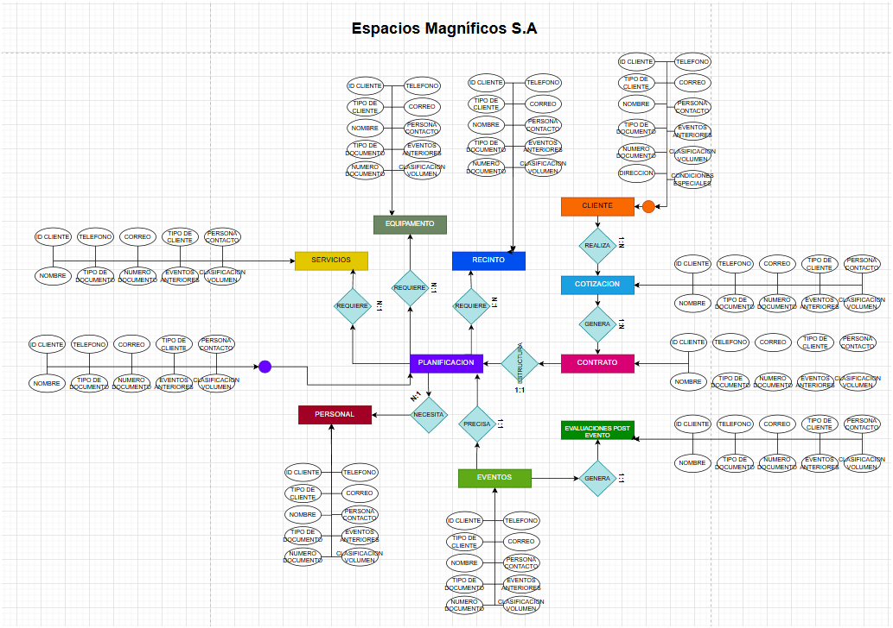

# TALLER
### TODOS LOS ARCHIVOS DE LOS SCRIPT'S ESTAN ADJUNTOS, Y ENLAZADOS, SOLO SE DEBE REALIZAR CLICK PARA ABRIR EL APARTADO

## Ejercicio 21

El centro de convenciones "Espacios Magníficos S.A." necesita un sistema para gestionar sus instalaciones y eventos. 

1. Cada recinto se registra con código único, nombre, tipo (salón, auditorio, sala de reuniones), ubicación dentro del complejo, dimensiones, capacidad según configuración (teatro, escuela, banquete), características técnicas, tarifas por hora/día y disponibilidad.

2. Los equipamientos incluyen código de inventario, tipo (audiovisual, mobiliario, decoración), descripción detallada, cantidad disponible, estado, ubicación de almacenamiento, valor de reposición, vida útil estimada y mantenimiento requerido.

3. Los servicios ofrecidos tienen código, nombre, categoría (catering, decoración, técnico, seguridad), descripción, proveedor interno/externo, condiciones de contratación, precio base, unidad de facturación (hora, persona, evento) y plazo mínimo de solicitud.

4. Los clientes se identifican con código único, tipo (corporativo, agencia, particular), razón social o nombre, documento fiscal, dirección, teléfono, correo electrónico, persona de contacto, eventos anteriores realizados, clasificación por volumen y condiciones especiales acordadas.

5. Los eventos programados documentan número único, título, tipo (congreso, boda, feria, concierto), cliente, fecha y hora inicio, fecha y hora fin, recintos reservados, montaje solicitado, número estimado de asistentes, servicios contratados, presupuesto aprobado, estado actual y responsable interno.

6. Las cotizaciones incluyen número secuencial, fecha de emisión, validez, cliente, evento propuesto, recintos sugeridos, servicios incluidos, detalle de costos, condiciones de pago, requisitos de confirmación, descuentos aplicables y observaciones.

7. Los contratos de eventos tienen número, fecha de firma, cliente, evento, condiciones generales, desglose de servicios, cronograma de pagos, políticas de cancelación, penalizaciones, cláusulas especiales, anexos y firmas autorizadas.

8. La planificación detalla código de evento, cronograma de actividades, horarios específicos, recintos y su configuración por franja horaria, necesidades técnicas, servicios de catering con horarios y menús, personal asignado y observaciones particulares.

9. El personal para eventos incluye código de empleado, nombres, apellidos, especialidad (coordinador, técnico, camarero, seguridad), disponibilidad por fechas, eventos asignados, horario asignado, responsabilidades específicas y tarifa aplicable.

10. Las evaluaciones post-evento documentan código, evento, fecha de evaluación, aspectos valorados, puntuación obtenida, comentarios del cliente, incidencias reportadas, lecciones aprendidas y recomendaciones para futuros eventos.

### CREACION DB Y TABLAS

[SCRIPT - CREAR DB Y TABLAS](Scripts/Creacion_DB_Y_Tablas.sql)

### INSERTAR DATOS

[SCRIPT - INSERTAR DATOS EN DB](Scripts/Insert_datos.sql)

## MODELO ENTIDAD RELACION
### [ENLACE DIRECTO A DRIVE](https://drive.google.com/file/d/1esl7uNhzW6a3gPgM-8oQCO-7HlL97M_O/view?usp=sharing)

## TABLAS NORMALIZADAS

# INSTRUCCIONES GENERALES
 
## Crear modelo Entidad-Relación: 
- Identificar correctamente entidades, atributos y relaciones
- Determinar cardinalidades (1:1, 1:M, N:M)
-	Diseñar el diagrama E-R de forma clara y completa

## Implementar eliminación en cascada: 
-	Identificar relaciones padre-hijo donde sea apropiado aplicar ON DELETE CASCADE
-	Implementar la restricción ON DELETE CASCADE en las claves foráneas relevantes

## Definir índices apropiados: 
-	Crear índices simples para columnas frecuentemente buscadas
-	Crear índices compuestos para búsquedas combinadas
-	Crear índices únicos para campos que no deben duplicarse
-	Crear índices de texto completo donde sea aplicable

## Implementar consultas con WHERE: 
-	Filtrar utilizando operadores de comparación (=, <>, >, <, >=, <=)
-	Combinar condiciones con operadores lógicos (AND, OR, NOT)
-	Usar operadores especiales (BETWEEN, IN, LIKE, IS NULL)

## Crear consultas con ORDER BY: 
-	Ordenar resultados por campos relevantes
-	Implementar ordenamiento ascendente y descendente
-	Ordenar por múltiples campos

## Aplicar funciones de agregación: 
-	Utilizar MIN/MAX para valores extremos
-	Emplear COUNT para conteos de registros
-	Implementar AVG para promedios
-	Usar SUM para totales

## Incorporar LIMIT en consultas: 
-	Restringir número de resultados
-	Implementar paginación

## Manejar valores NULL: 
-	Definir campos que permitan o no valores nulos
-	Filtrar por campos nulos/no nulos
-	Usar funciones COALESCE/IFNULL cuando sea apropiado
  
## Aplicar búsquedas con LIKE: 
-	Buscar patrones en campos de texto
-	Utilizar comodines % y _ adecuadamente

## Utilizar operador IN: 
-	Filtrar por listas de valores
-	Crear subconsultas con IN

## Implementar funciones de fecha: 
-	Extraer componentes de fechas
-	Realizar cálculos entre fechas
-	Agrupar por períodos de tiempo

## Crear consultas combinadas: 
-	Combinar múltiples operadores y funciones
-	Crear consultas jerárquicas

# PREGUNTAS
## SISTEMA DE GESTIÓN PARA EVENTOS Y CONVENCIONES "EVENTPRO"
1.	¿Cuáles son todos los servicios contratados para un evento específico?
2.	¿Qué eventos tienen más de 200 asistentes?
3.	¿Cuáles son los recintos disponibles el 10 de mayo de 2024 con capacidad mínima de 100 personas?
4.	¿Qué eventos son conferencias o reuniones corporativas?
5.	¿Cuáles son las cotizaciones emitidas en febrero de 2024?
6.	¿Qué equipamientos son de tipo Audiovisual, Mobiliario o Iluminación?
7.	¿Cuáles son los servicios con descripciones que contienen las palabras "premium" o "exclusivo"?
8.	¿Qué eventos pasados no tienen evaluación post-evento?
9.	¿Cuáles son los recintos ordenados por capacidad descendente y tarifa ascendente?
10.	¿Cuáles son los ingresos totales por tipo de evento y mes?

# TRIGGERS - VIEWS - SP's - EVENTS - FUNCTIONS

Este sistema administra un centro de convenciones, recintos, equipamientos, servicios, clientes, eventos y personal.

### Procedimientos Almacenados:
1.	CrearCotizacionEvento: Crea una cotización detallada para un evento potencial.
2.	ReservarRecinto: Reserva un recinto para un evento verificando disponibilidad.
3.	AsignarEquipamientoEvento: Asigna equipamiento necesario para un evento.
4.	ProgramarPersonalEvento: Programa el personal necesario según tipo de evento.
5.	RegistrarEvaluacionPostEvento: Registra la evaluación y feedback posterior a un evento.
### Triggers:
1.	TR_ActualizarDisponibilidadRecinto: Actualiza la disponibilidad de recintos tras reservas.
2.	TR_VerificarConflictosHorarios: Verifica posibles conflictos horarios al programar eventos.
3.	TR_ActualizarInventarioEquipamiento: Actualiza el inventario de equipamiento tras asignación.
4.	TR_CalcularCostosEvento: Recalcula automáticamente los costos al modificar servicios.
5.	TR_GenerarCronogramaActividades: Genera un cronograma detallado al confirmar un evento.
### Vistas:
1.	V_EventosProgramados: Calendario de eventos programados por recinto.
2.	V_DisponibilidadRecintos: Muestra la disponibilidad de recintos por fecha y hora.
3.	V_EquipamientoDisponible: Inventario de equipamiento disponible por tipo.
4.	V_CotizacionesPendientes: Lista de cotizaciones pendientes de aprobación.
5.	V_AsignacionPersonal: Detalle de asignación de personal por evento.
### Eventos:
1.	EVT_VerificarPreparativosEventos: Verifica preparativos para eventos próximos.
2.	EVT_GenerarReportesPostEvento: Genera reportes posteriores a eventos realizados.
3.	EVT_ActualizarDisponibilidadTemporal: Actualiza la disponibilidad temporal de recintos.
4.	EVT_ControlarMantenimientoEquipos: Programa mantenimiento preventivo de equipos.
5.	EVT_AnalizarRendimientoServicios: Analiza el rendimiento y satisfacción por tipo de servicio.
### Funciones:
1.	FN_CalcularCapacidadConfiguracion: Calcula la capacidad de un recinto según configuración.
2.	FN_VerificarDisponibilidadPeriodo: Verifica disponibilidad de un recinto para un periodo.
3.	FN_ObtenerPersonalDisponible: Identifica personal disponible según tipo y fecha.
4.	FN_CalcularPresupuestoEvento: Calcula el presupuesto total de un evento según servicios.
5.	FN_EstimarOcupacionAnual: Estima la ocupación anual de recintos según histórico.

