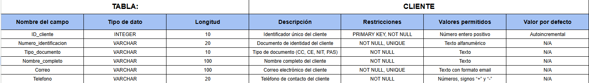

<h1 align="center"><b>Restaurante Gourmet - Sabor exquisito </b></h1>

## Enunciado

11: Restaurante Gourmet

"El restaurante 'Sabor Exquisito' gestiona reservas y pedidos. Cada mesa tiene un número único, capacidad y ubicación (interior, terraza). Los clientes se registran con su DNI, nombre completo, teléfono y correo electrónico. Las reservas incluyen la fecha, hora, número de personas y mesa asignada. Los pedidos se registran con un número único, fecha, hora, platos solicitados (cada uno con su código, nombre y precio), bebidas y el total a pagar. Además, el restaurante lleva un inventario de ingredientes, registrando el nombre, cantidad disponible y proveedor."

## DER (Diagrama Entidad Relacion)

## Diccionario de datos

### Tabla cliente

### Tabla mesa
